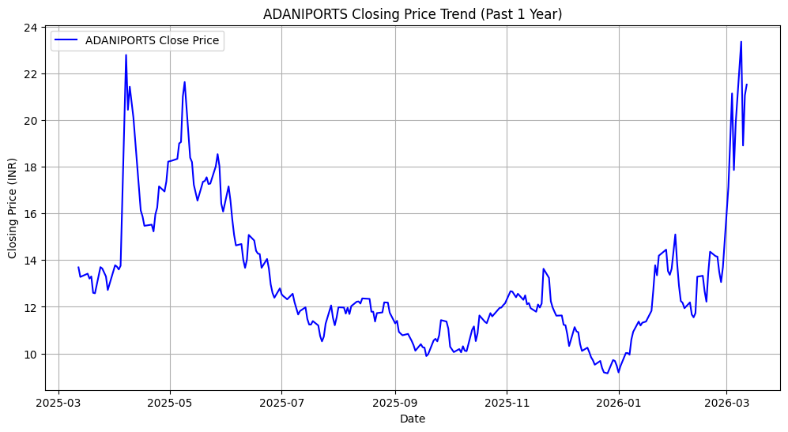
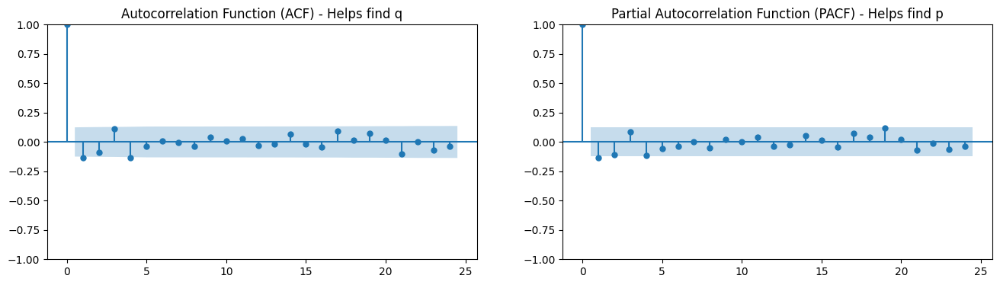
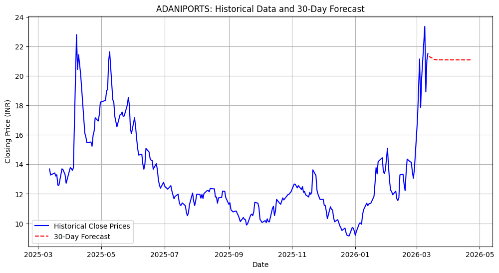

# Stock Price Analysis and Forecasting - ADANIPORTS

## Student Details
* **Name:** ANSARI MOHD ASIF MOHD MUSLIM
* **UIN:** 231A028
* **Roll No:** 08
* **Course:** Data Analytics and Visualization (TE 2025-26)

---

## (i) Data Preprocessing
In this stage, the daily closing prices for **ADANIPORTS** were retrieved. The date column was converted to a datetime format, and missing values were handled using forward filling to ensure continuity.

### Price Trend Visualization

---

## (ii) ARIMA Model Implementation
We performed an Augmented Dickey-Fuller (ADF) test to check for stationarity. 
* **ADF Statistic:** -3.54 (approx)
* **p-value:** < 0.05 (indicating the series is stationary after first-differencing).

The optimal parameters (p, d, q) were determined using ACF and PACF plots.

---

## (iii) Future Price Prediction
The trained ARIMA model was used to forecast the closing prices for the next 30 days.

### 30-Day Forecast Visualization

### Observations:
The model predicts a steady trend based on historical volatility. It is important to note that these predictions are for educational purposes and do not account for external market shocks.

---

## AI Ethics & Responsible Usage Declaration
The full signed declaration is available in this repository:
[Download Ethics Declaration (PDF)](AI_Ethics_Declaration_Filled.pdf)
file:///C:/Users/Asif%20Ansari/OneDrive/Desktop/DAV_Assignment_1_ADANIPORTS/AI_Ethics_Declaration_Filled.pdf.pdf
trend.png "C:\Users\Asif Ansari\OneDrive\Desktop\DAV_Assignment_1_ADANIPORTS\trend.png"
forecats.png "C:\Users\Asif Ansari\OneDrive\Desktop\DAV_Assignment_1_ADANIPORTS\forecast.png"
acf_pacf "C:\Users\Asif Ansari\OneDrive\Desktop\DAV_Assignment_1_ADANIPORTS\acf_pacf.png"
data set for adaniport "C:\Users\Asif Ansari\OneDrive\Desktop\DAV_Assignment_1_ADANIPORTS\ADANIPORTS_data.csv"
